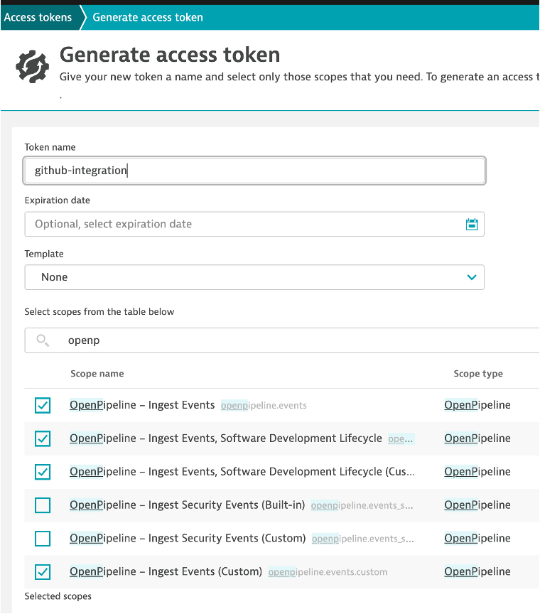
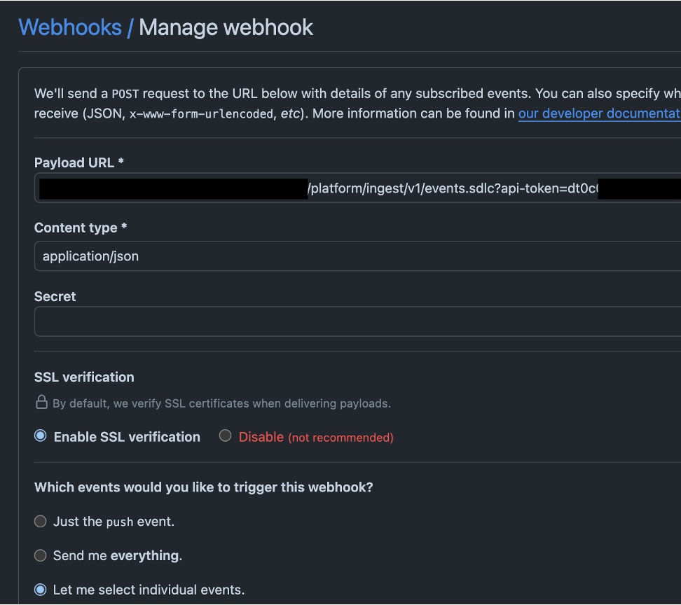

# Dynatrace Ingester

This is a GitHub action has been **deprecated**. To monitor GitHub with Dynatrace the recommended approach is to use GitHub webhooks.

## Instructions

To capture the information about GitHub in Dynatrace you can use GitHub webhooks and the SDLC event endpoint:

1. Get an access token with the following permissions:
`openPipeline- Ingest events`
`openPipeline - Ingest Software Development Lifecycle` 
`openPipeline - Ingest Software Development Lifecycle (Custom)` 

2. Configure webhook at the GitHub Organization level or the repository level (depends on if you want to monitor a specific repo or all the organization repos)

Go to Settings > Webhooks and add the following:

Payload URL:
`https://xxxx.live.dynatrace.com/platform/ingest/v1/events.sdlc?api-token=<put-previous-token-here>`

`Content type: application/json`

At least 2 events will need to be sent to have pipeline observability but more can be enabled to calculate additional metrics:

3. Test the connectivity

Trigger a GitHub workflow and test that the events and getting into Dynatrace.
 
Verify the events using the following DQL in a Dynatrace Notebook:

`fetch events| filter event.kind=="SDLC_EVENT" AND isNotNull(workflow_run)`

If you spot any issues check GitHub webhook logs
